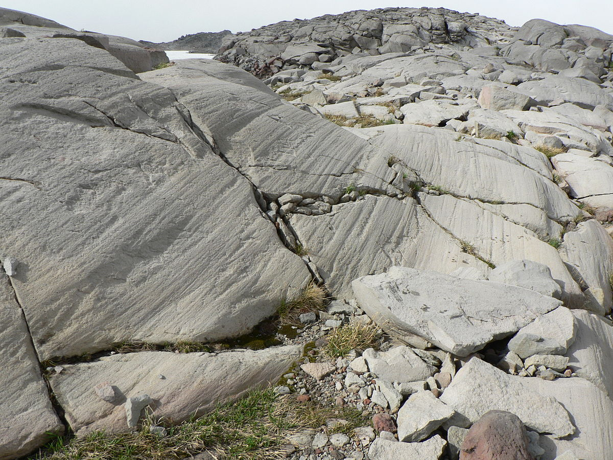

```{r setup, include=FALSE}
knitr::opts_chunk$set(echo = FALSE)
```

## Overview

- Introduction to paleoclimate
- Glacial geomorphology
- Stable water isotopes
- Ice core reconstructions

## Paleoclimate

- Study of the climate (temperature, moisture, wind vectors, etc.) prior to direct, quantitative observations of climatological variables

- Why would we want to know about climate in the past?

## Paleoclimate

- How do we measure temperature?

## Paleoclimate

- How do we measure temperature?
    - Mercury displacement (traditional thermometers)
    - Changes in electrical properties (digital thermometers)
    - Emission spectrum (satellites, infrared sensors)
    
- Direct temperature measurements only go back a few hundred years

- How can we estimate temperature before thermometers?
    - Proxies

## Paleoclimate proxies

- An indiect measurement of a variable (i.e. the proxy) that is correlated with some other variable of interest (e.g. temperature)

- Percentage of people wearing a coat

- Examples of temperature proxies:
    - Coral distributions
    - Tree ring widths
    - Types and fequency of vegetation/pollen
    
- Focus on two specific proxies
    - Glacial geomorphology
    - Isotopes in ice cores
    
## Glacial geomorphology


## Glacial geomorphology

- Changes in landscape due to presence or changes in nearby glaciers
    - Glacier valleys
    - Moraines
    - Meltwater planes
    - Glacial scouring
    - Glacial erratics

----

Example of glacial erratic


----

Example of glacial scour




## Review of glacier mass balance


----

$$\dot{b} = accumulation - ablation$$

- What happens if temperatures increase?
- What happens if more snow falls?

----

$\dot{b} = accumulation - ablation$


----

## Moraines

- Mass of rock and debris pushed by movement of glacier (best preserved in equilibrium)
- Records the extent of a glacier at a specific point in time
- Three types of moraines:
    - Lateral
    - Medial
    - Terminal

----


## Moraines

- We can use moraine positions to reconstruct glacier growth/retreat over time
- We can then make inferences about the changes in climate driving those glacial changes

----


## Complications

- Different glaciers respond to climate differently
- Features can erode naturallly, or overridden by later glacial events
- Difficult to seperate effects of different climatic variables (e.g. temperature or preciptation?)
- Can be difficult to place a specific moraine set to an absolute point in time

----

## Ice cores


## Stable water isotopes

- Focus specifically on two isotope species
    - Deuterium ($^2H$) and oxygen-18 ($^{18}O$)

- Stable isotopes (i.e. they do not decay over time)

- Naturally occurring, but in much lower abundance

- Isotopes behave chemically similar to more abundant variety
    - Forms water molecules (e.g. $H_2^{18}O$ and $^1H^2H^{18}O$)

## Isotope review

- Same element with differing number of neutrons in the nucleus


----


----

## Fractionation physics

- Although chemically similar, isotopes respond slightly differently due to differences in bond strength and diffusion velocity

- Heavier isotopes (e.g. $^2H$ and $^{18}O$) vibrate at a lower frequency and diffuse more slowly (conservation of momentum)
    - Energetically more favorable in lower energy states

- This leads to a fractionation effect i.e. a preference of heavier isotopes go into/remain in lower energy phases
    - Isotopic ratio changes during a phase change

----


----


----

- Measure isotopic values as a ratio between the rare isotope and the more common form
    - E.g. $^{18}R = \frac{[H_2^{18}O]} {[H_2^{16}O]}$

- More informative when we express these ratios relative to a standard (V-SMOW)
    - $\delta^{18}O = \frac{^{18}R_{sample} - ^{18}R_{std}} {^{18}R_{std}} x 1000$

----

- Evaporation leads to a water vapor depleted in heavier isotopes, and remnant liquid water enriched


## Equilibrium fractionation

- Equilibrium and kinetic fractionation influence final $\delta$ values

- In regards to precipitation cycles, most of the isotopic fractionation is governed by equilibrium effects

- Vapor transport gives sufficient time for liquid/vapor constituents to remain in equilibrium

- The amount of equilibrium fractionation is governed by a reaction constant (the 'fractionation factor' $\alpha$)

$$\alpha^{18}O_{water-vapor} = \frac{(^{18}O/^{16}O)_{water}} {(^{18}O/^{16}O)_{vapor}}$$

----

- At lower temperatures, this fractionation constant is highly temperature-dependent

$$10^3 \cdot ln(\alpha^a_b) = \frac {A \cdot 10^6} {T^2} + B$$

- (A and B are constants unique to the substances in exchange)

$$10^3 ln(\alpha^a_b) \approx \delta_a - \delta_b = \Delta^a_b$$

----

- Dansgaard determined an empirical estimate of temperature from $\delta^{18}O$ values:
$$\delta^{18}O \approx 0.62 \cdot T - 15.25$$

- Can be subject to localized variation as well


## Paleoclimate reconstruction


----


----

## Paleoclimate reconstruction


----


----


# Brainstorm

- How do we know what the climate was in the past?
- What was climate like in the past?
- What will it be in the future?

## How do we know

- Glacial geomorphology
- Ice cores
- 
